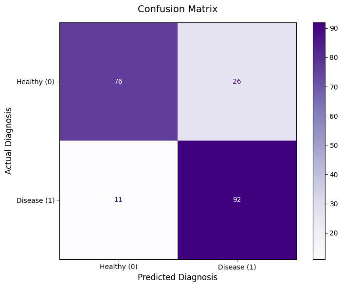

# Heart Disease Exploratory Data Analysis (EDA & ML) 🫀
**Author:** Iga Szaflik

This repository contains a comprehensive Exploratory Data Analysis (EDA) and a Machine Learning pipeline for a clinical Heart Disease dataset. The goal of this project is to investigate the relationships between medical test results, build a diagnostic predictive model, and expose the dangers of data bias in AI.

## Project Overview
This project goes beyond simple predictions. It focuses heavily on **Data Understanding, Feature Engineering, and Explainable AI**. By using custom `matplotlib` charts, the analysis uncovers highly counterintuitive medical trends. Furthermore, it implements an industry-standard Logistic Regression model and tests it against custom, out-of-distribution data to demonstrate how small sample sizes can critically skew AI logic.

## Technologies Used
* **Python 3.x**
* **Pandas** (Data manipulation, grouping, binning, and statistical aggregations)
* **Matplotlib** (Advanced visualizations: Heatmaps, Boxplots, Grouped Bar Charts, and Multivariate Bubble Charts)
* **Scikit-learn** (Machine Learning: Logistic Regression, StandardScaler, Train/Test Split, Confusion Matrix)
* **Jupyter Notebook** (Interactive environment)

## Key Insights Discovered
During the analysis, several fascinating patterns emerged:
1. **The "Typical Angina" Paradox:** Patients diagnosed with "Typical Angina" (Type 0) actually had the *lowest* rate of heart disease in this sample (~24.5%), whereas "Atypical" and "Non-anginal" pain types were major red flags (over 75% diagnosis rate).

1. **The Thalach Anomaly:** In this specific dataset, patients who achieved a *higher* maximum heart rate (`thalach`) during stress tests were significantly more likely to be diagnosed with heart disease, pushing close to their theoretical physical limits (`220 - age`).

1. **Strongest Predictors:** The mathematical correlation matrix proved that ST depression (`oldpeak`) and exercise-induced angina (`exang`) have the strongest predictive power, showing a powerful *inverse* relationship with the disease.

4. **Safety-First Machine Learning:** A Logistic Regression model was trained to predict disease presence, achieving ~82% accuracy. The Confusion Matrix revealed that the model is "over-cautious"—it minimizes critical medical errors (False Negatives) at the cost of triggering more false alarms (False Positives).

1. **Exposing AI Data Bias:** When testing the model on custom data for a healthy 21-year-old, the AI predicted an 89.8% risk of heart disease. Cross-referencing this with the EDA revealed a severe **small sample size bias**: the dataset contained only 4 patients in the 20-30 age group, and 100% of them were sick. The model falsely learned that being in your 20s guarantees disease, perfectly illustrating why domain knowledge and data distribution context are strictly necessary before trusting AI.

## How to Run the Project
1. Clone this repository to your local machine:
   ```bash
   git clone https://github.com/igasz/heart-disease-eda.git
   ```
2. Navigate to the project directory and install the required dependencies:
    ```bash
    pip install pandas matplotlib numpy scikit-learn
    ```
3. Open the Jupyter Notebook:
    ```bash
    jupyter notebook heart_disease_eda.ipynb
    ```

*(Note: Make sure the heart.csv file is located in the same directory as the notebook).*

## Dataset Details
The dataset used in this project is a popular Kaggle version of the Cleveland Heart Disease dataset, containing 1025 rows and 14 clinical attributes (such as age, sex, chest pain type, resting blood pressure, cholesterol, etc.).
